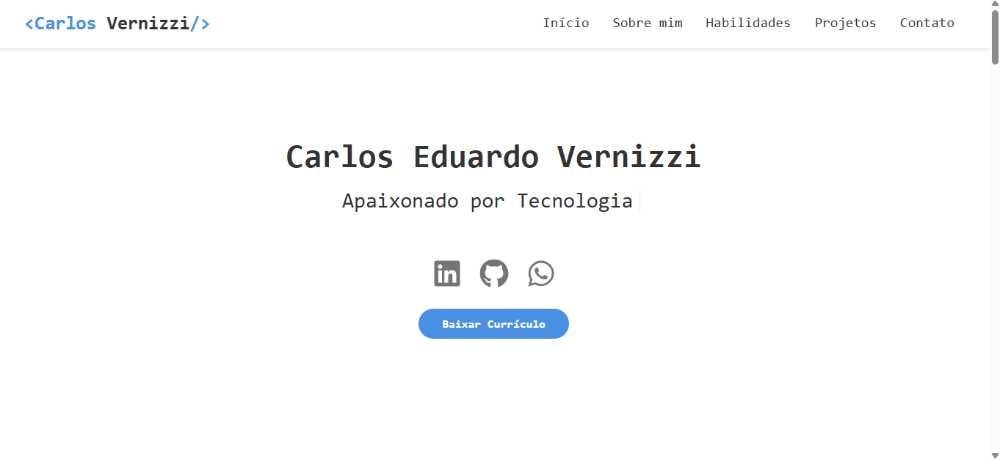

# Portfólio - Eduardo Vernizzi

Este é o repositório do meu portfólio profissional, desenvolvido com **React + Vite** e hospedado na **Vercel**. O projeto apresenta minhas habilidades, experiências e projetos de forma moderna, responsiva e com animações elegantes.

## 🌐 Acesse o site

🔗 [vernizzidev.vercel.app](https://vernizzidev.vercel.app)

## ✨ Funcionalidades

- Layout responsivo com foco em usabilidade
- Menu com animações e transições suaves
- Seção "Sobre mim" com imagem e descrição animada
- Cards de skills com ícones e textos descritivos
- Carrossel de projetos em esteira contínua
- Seção de contato com links diretos para WhatsApp, GitHub e LinkedIn
- Botão para baixar currículo em PDF

## 🛠️ Tecnologias Utilizadas

- React + Vite
- CSS3 / Bootstrap 5
- AOS (Animate On Scroll)
- React Icons
- React Fast Marquee
- Vercel (Deploy)
